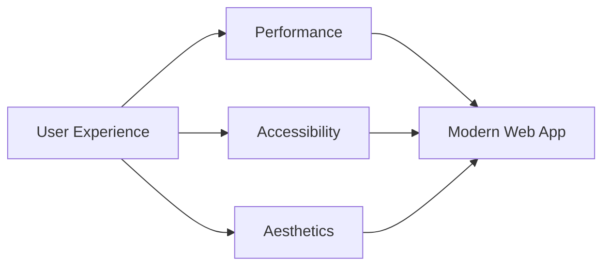
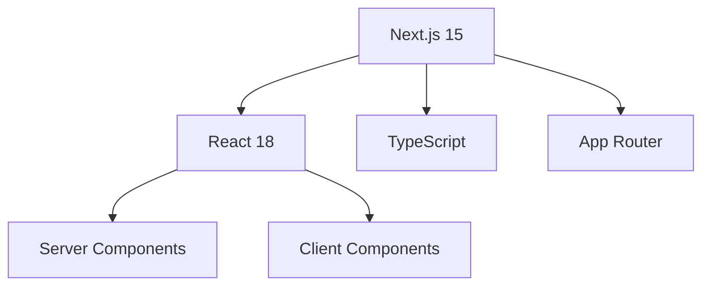
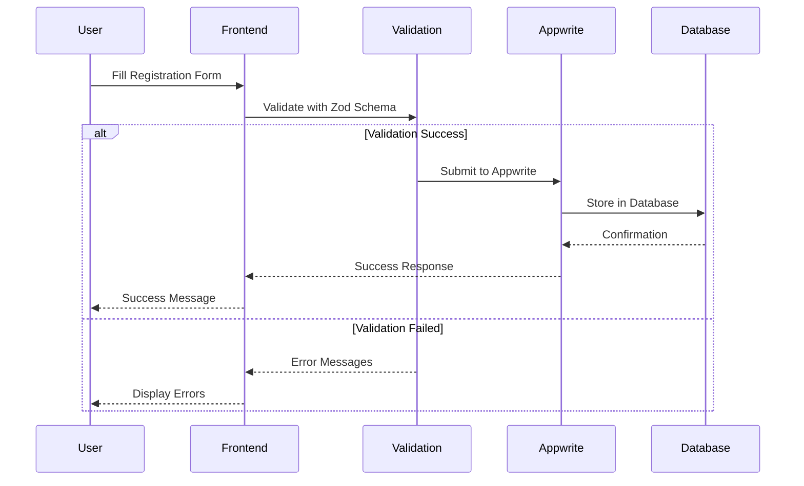
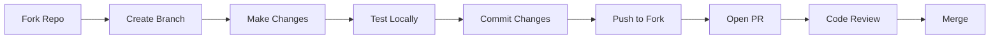

<div align="center">

# 

### AI Society - Bennett University Official Website

[](https://nextjs.org/)
[](https://www.typescriptlang.org/)
[](https://tailwindcss.com/)
[](https://opensource.org/licenses/MIT)

**[Live Demo](https://ai-society.club)** • **[Documentation](#-documentation)** • **[Contributing](#-contributing)**

_Training Minds, One Epoch at a Time_ 🧠✨

</div>

---

## 📋 Table of Contents

- [Overview](#-overview)
- [Key Features](#-key-features)
- [Tech Stack](#-tech-stack)
- [Architecture](#-architecture)
- [Getting Started](#-getting-started)
- [Project Structure](#-project-structure)
- [Configuration](#-configuration)
- [Deployment](#-deployment)
- [Performance](#-performance)
- [Contributing](#-contributing)
- [Support](#-support)
- [License](#-license)

---

## 🎯 Overview

AIS-WEB is a modern website for the Artificial Intelligence Society at Bennett University. Built with cutting-edge web technologies, it features immersive animations, dynamic project showcases, and seamless member registration capabilities.

### 🎨 Design Philosophy



---

## ✨ Key Features

<table>
<tr>
<td width="50%">

### 🎭 Interactive Design

- ⚡ **GSAP-Powered Animations**
- 🖱️ **Custom Cursor Effects**
- 🌊 **Parallax Scrolling**
- 📱 **Fully Responsive**
- 🎬 **Smooth Page Transitions**

</td>
<td width="50%">

### 🛠️ Technical Excellence

- ✅ **Form Validation (Zod)**
- 💾 **Appwrite Integration**
- 🎯 **TypeScript Type Safety**
- 🚀 **Performance Optimized**
- ♿ **Accessibility First**

</td>
</tr>
</table>

### 📑 Pages

| Page                 | Description                    | Key Features                              |
| -------------------- | ------------------------------ | ----------------------------------------- |
| 🏠 **Home**          | Landing page with hero section | Stats, teams, leadership showcase         |
| 🚀 **Projects**      | Dynamic project gallery        | Detailed views, tech stacks, GitHub links |
| 📅 **Events**        | Event timeline & details       | Interactive timeline, event pages         |
| 👥 **Join Us**       | Registration form              | Multi-step validation, Appwrite backend   |
| 📢 **Announcements** | Society updates                | Latest news and announcements             |

---

## 🛠 Tech Stack

### Frontend Framework



### Core Technologies

<table>
<tr>
<td valign="top" width="33%">

#### 🎨 Styling

- **Tailwind CSS** - Utility-first CSS
- **PostCSS** - CSS processing
- **Autoprefixer** - Vendor prefixing

</td>
<td valign="top" width="33%">

#### ✨ Animation

- **Framer Motion** - React animations
- **GSAP** - Advanced animations
- **Lenis** - Smooth scrolling

</td>
<td valign="top" width="33%">

#### 🔧 Development

- **ESLint** - Code linting
- **TypeScript** - Type safety
- **React Hook Form** - Forms
- **Zod** - Validation

</td>
</tr>
</table>

### Backend & Database

```
┌─────────────────────────────────────────┐
│           Appwrite Backend              │
├─────────────────────────────────────────┤
│  • Database (NoSQL)                     │
│  • Authentication                       │
│  • Storage                              │
│  • Real-time APIs                       │
└─────────────────────────────────────────┘
```

---

## 🏗 Architecture

### Component Hierarchy

```
AIS-WEB Application
│
├── 🎯 Core Layout
│   ├── Navigation
│   ├── Page Transition
│   └── Footer
│
├── 🏠 Homepage
│   ├── Parallax Hero
│   ├── About Section
│   ├── Stats Counter
│   ├── Team Cards
│   └── Leadership
│
├── 🚀 Projects
│   ├── Project Grid
│   └── Dynamic Project Pages
│
├── 📅 Events
│   ├── Event Timeline
│   └── Event Details
│
└── 👥 Registration
    ├── Multi-Step Form
    ├── Validation Layer
    └── Appwrite Integration
```

### Data Flow



---

## 🚀 Getting Started

### Prerequisites

| Tool     | Version | Purpose             |
| -------- | ------- | ------------------- |
| Node.js  | 18+     | Runtime environment |
| npm/yarn | Latest  | Package manager     |
| Git      | Latest  | Version control     |

### Installation

```bash
# 1. Clone the repository
git clone https://github.com/your-username/AIS-WEB.git
cd AIS-WEB

# 2. Install dependencies
npm install

# 3. Set up environment variables
cp .env.example .env.local

# 4. Run development server
npm run dev
```

### Environment Variables

Create a `.env.local` file with the following variables:

```env
NEXT_PUBLIC_APPWRITE_ENDPOINT=your_appwrite_endpoint
NEXT_PUBLIC_APPWRITE_PROJECT_ID=your_project_id
NEXT_PUBLIC_APPWRITE_DATABASE_ID=your_database_id
NEXT_PUBLIC_APPWRITE_COLLECTION_ID=your_collection_id
```

> **⚠️ Security Note:** Never commit `.env.local` or any files containing sensitive credentials to version control. Add them to `.gitignore`.

<details>
<summary>📖 How to get Appwrite credentials</summary>

1. Create an account at [Appwrite Cloud](https://cloud.appwrite.io/)
2. Create a new project
3. Navigate to Settings → Copy Project ID
4. Create a database and collection
5. Copy the Database ID and Collection ID

</details>

---

## 📁 Project Structure

```
AIS-WEB/
│
├── 📱 app/                      # Next.js App Router
│   ├── announcements/          # Announcements page
│   ├── event/                  # Events section
│   ├── join/                   # Registration
│   │   └── appwrite/          # Backend config
│   ├── projects/              # Project showcase
│   │   └── [id]/             # Dynamic routes
│   ├── globals.css            # Global styles
│   ├── layout.tsx             # Root layout
│   └── page.tsx               # Homepage
│
├── 🧩 components/              # React components
│   ├── ui/                    # Base UI components
│   │   ├── button.tsx
│   │   ├── card.tsx
│   │   └── input.tsx
│   ├── about.tsx              # About section
│   ├── hero.tsx               # Hero component
│   ├── navigation.tsx         # Navigation bar
│   └── enhanced-team-cards.tsx # Team cards
│
├── 📊 data/                    # Static data
│   ├── data.ts                # General data
│   ├── event-data.ts          # Event info
│   └── projects.ts            # Project data
│
├── 🎣 hooks/                   # Custom hooks
│   └── use-mobile.ts          # Mobile detection
│
├── 📚 lib/                     # Utilities
│   ├── lenis.ts               # Smooth scroll
│   └── utils.ts               # Helper functions
│
├── 🎨 public/                  # Static assets
│   ├── images/                # Images
│   └── fonts/                 # Custom fonts
│
└── 📝 Configuration files
    ├── next.config.mjs        # Next.js config
    ├── tailwind.config.js     # Tailwind config
    ├── tsconfig.json          # TypeScript config
    └── package.json           # Dependencies
```

---

## ⚙ Configuration

### Available Scripts

| Command         | Description                                  |
| --------------- | -------------------------------------------- |
| `npm run dev`   | Start development server at `localhost:3000` |
| `npm run build` | Create production build                      |
| `npm run start` | Start production server                      |
| `npm run lint`  | Run ESLint for code quality                  |

### Tailwind Configuration

```javascript
// Custom animations and utilities
/** @type {import('tailwindcss').Config} */
const defaultConfig = require("tailwindcss/defaultConfig");

module.exports = {
  darkMode: ["class"],
  content: [
    "./pages/**/*.{js,ts,jsx,tsx,mdx}",
    "./components/**/*.{js,ts,jsx,tsx,mdx}",
    "./app/**/*.{js,ts,jsx,tsx,mdx}",
    "*.{js,ts,jsx,tsx,mdx}",
  ],
  theme: {
    ...defaultConfig.theme,
    extend: {
      colors: {
        black: "#000000",
        white: "#ffffff",
        gray: {
          100: "#f7f7f7",
          200: "#e1e1e1",
          300: "#cfcfcf",
          400: "#b1b1b1",
          500: "#9e9e9e",
          600: "#7e7e7e",
          700: "#626262",
          800: "#515151",
          900: "#3b3b3b",
        },
        border: "hsl(var(--border))",
        input: "hsl(var(--input))",
        ring: "hsl(var(--ring))",
        background: "hsl(var(--background))",
        foreground: "hsl(var(--foreground))",
        primary: {
          DEFAULT: "hsl(var(--primary))",
          foreground: "hsl(var(--primary-foreground))",
        },
        secondary: {
          DEFAULT: "hsl(var(--secondary))",
          foreground: "hsl(var(--secondary-foreground))",
        },
        destructive: {
          DEFAULT: "hsl(var(--destructive))",
          foreground: "hsl(var(--destructive-foreground))",
        },
        muted: {
          DEFAULT: "hsl(var(--muted))",
          foreground: "hsl(var(--muted-foreground))",
        },
        accent: {
          DEFAULT: "hsl(var(--accent))",
          foreground: "hsl(var(--accent-foreground))",
        },
        popover: {
          DEFAULT: "hsl(var(--popover))",
          foreground: "hsl(var(--popover-foreground))",
        },
        card: {
          DEFAULT: "hsl(var(--card))",
          foreground: "hsl(var(--card-foreground))",
        },
      },
      fontFamily: {
        sans: ["Inter", "sans-serif"],
      },
      animation: {
        "bounce-slow": "bounce 2s infinite",
        "pulse-slow": "pulse 3s infinite",
      },
      borderRadius: {
        lg: "var(--radius)",
        md: "calc(var(--radius) - 2px)",
        sm: "calc(var(--radius) - 4px)",
      },
    },
  },
  plugins: [require("tailwindcss-animate")],
};
```

### Performance Optimizations

- ✅ Image optimization with Next.js Image
- ✅ Automatic code splitting
- ✅ Lazy loading components
- ✅ Mobile-optimized animations
- ✅ Reduced motion support

---

## 🚀 Deployment

### Deploy to Vercel (Recommended)

1. Push your code to GitHub
2. Import your repository to [Vercel](https://vercel.com)
3. Configure environment variables in project settings
4. Deploy automatically

```bash
# Manual deployment via Vercel CLI
npm i -g vercel
vercel --prod
```

### Deployment Checklist

- [ ] Set environment variables in hosting platform
- [ ] Configure Appwrite production endpoint
- [ ] Test all forms and validations
- [ ] Verify mobile responsiveness
- [ ] Check animation performance
- [ ] Test all dynamic routes
- [ ] Enable HTTPS/SSL
- [ ] Configure custom domain (if applicable)

### Other Platforms

<details>
<summary>Netlify Deployment</summary>

```bash
npm run build
# Deploy dist folder to Netlify
# Configure build command: npm run build
# Publish directory: .next
```

</details>

<details>
<summary>Custom Server Deployment</summary>

```bash
npm run build
npm run start
# Configure reverse proxy (nginx/apache)
# Set up PM2 or similar process manager
```

</details>

---

## 📈 Performance

### Lighthouse Scores

| Metric            | Score | Status       |
| ----------------- | ----- | ------------ |
| 🎯 Performance    | 95+   | ✅ Excellent |
| ♿ Accessibility  | 100   | ✅ Perfect   |
| 🎨 Best Practices | 100   | ✅ Perfect   |
| 🔍 SEO            | 100   | ✅ Perfect   |

### Core Web Vitals

```
┌─────────────────────────────────────┐
│  LCP (Largest Contentful Paint)    │
│  ██████████████████░░  < 2.5s ✅   │
├─────────────────────────────────────┤
│  FID (First Input Delay)            │
│  ████████████████████  < 100ms ✅  │
├─────────────────────────────────────┤
│  CLS (Cumulative Layout Shift)      │
│  ████████████████████  < 0.1 ✅    │
└─────────────────────────────────────┘
```

---

## 🤝 Contributing

We welcome contributions from the community! Here's how you can help:

### Contribution Workflow



### Development Guidelines

<table>
<tr>
<td>

#### ✅ Do's

- Follow TypeScript best practices
- Write meaningful commit messages
- Test on multiple devices
- Add comments for complex logic
- Ensure mobile responsiveness

</td>
<td>

#### ❌ Don'ts

- Don't commit `.env` files
- Avoid large file uploads
- Don't skip testing
- Avoid hardcoded values
- Don't ignore ESLint warnings

</td>
</tr>
</table>

### Code Style

```typescript
// Good ✅
const fetchProjects = async (): Promise<Project[]> => {
  try {
    const response = await api.get("/projects");
    return response.data;
  } catch (error) {
    console.error("Error fetching projects:", error);
    throw error;
  }
};

// Bad ❌
const getProjects = async () => {
  const response = await api.get("/projects");
  return response.data;
};
```

---

## 🐛 Troubleshooting

<details>
<summary>Build fails with TypeScript errors</summary>

```bash
# Clear cache and rebuild
rm -rf .next node_modules
npm install
npm run build
```

</details>

<details>
<summary>Animations not working on mobile</summary>

Check that GSAP plugins are registered and mobile optimization is enabled:

```typescript
gsap.registerPlugin(ScrollTrigger);
ScrollTrigger.defaults({ markers: false });
```

</details>

<details>
<summary>Form submission fails</summary>

Verify Appwrite configuration:

1. Check environment variables
2. Verify database permissions
3. Test API endpoint connectivity
4. Check CORS settings in Appwrite console
</details>

---

## 📞 Support

Need help? We're here for you!

- **📧 Email:** ais@bennett.edu.in
- **🐛 Issues:** [GitHub Issues](https://github.com/your-username/AIS-WEB/issues)
- **💬 Discussions:** [GitHub Discussions](https://github.com/your-username/AIS-WEB/discussions)

---

## 🔒 Security

### Reporting Security Issues

If you discover a security vulnerability, please email us at **ais@bennett.edu.in** instead of using the public issue tracker.

### Security Best Practices

- Never commit sensitive credentials
- Keep dependencies updated
- Use environment variables for configuration
- Implement rate limiting on forms
- Validate all user inputs
- Enable HTTPS in production

---

## 📄 License

This project is licensed under the MIT License - see the [LICENSE](LICENSE) file for details.

```
MIT License

Copyright (c) 2024 AI Society - Bennett University

Permission is hereby granted, free of charge, to any person obtaining a copy
of this software and associated documentation files (the "Software"), to deal
in the Software without restriction...
```

---

## 🙏 Acknowledgments

This project wouldn't be possible without:

- **Bennett University** - Supporting the AI Society
- **Contributors** - Building amazing features together
- **Open Source Community** - Providing incredible tools and libraries
- **Design Community** - Inspiring modern web design trends

---

<div align="center">

### 🌟 Star us on GitHub!

If you find this project useful, please consider giving it a star ⭐

**Made with ❤️ by the AI Society - Bennett University**

_Training Minds, One Epoch at a Time_ 🧠✨


</div>
